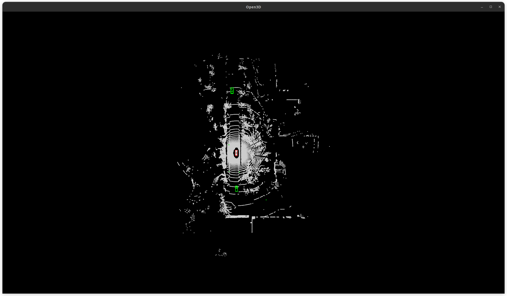
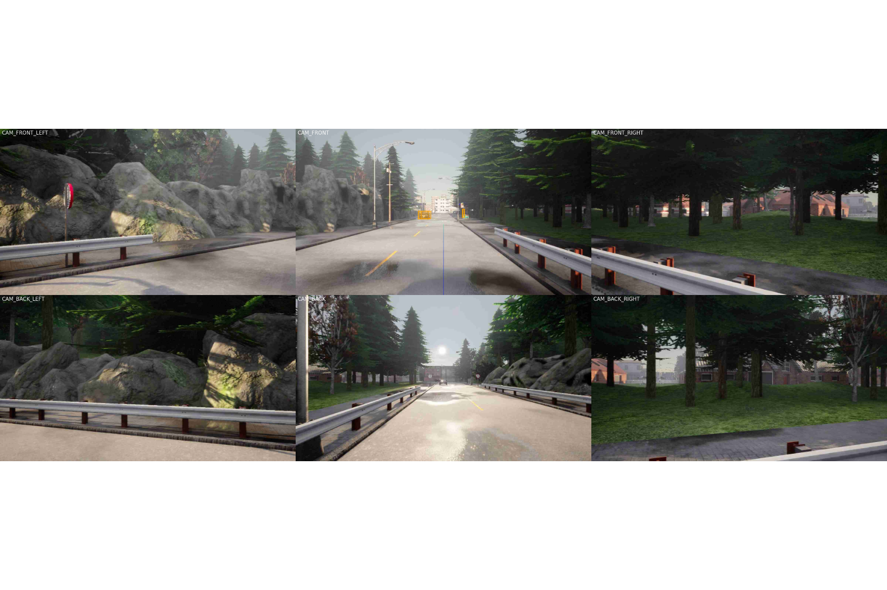

# Visualization

The following code loads a dataset config for visualization


```python

import sys
sys.path.append('')

import os 
import cv2
import numpy as np
import torch 

from mmengine.config import Config
from mmengine.registry import init_default_scope

from mmdet3d.structures import LiDARInstance3DBoxes, limit_period, Box3DMode
from fsd.registry import DATASETS, VISUALIZERS

# dataset config
ds_cfg = Config.fromfile('fsd/configs/_base_/dataset/carla_dataset.py')

# visualize config
vis_cfg = Config(dict(
    type='PlanningVisualizer',
    _scope_ = 'fsd',
    save_dir='temp_dir',
    vis_backends=[dict(type='LocalVisBackend')],
    name='vis')
)

# build dataset and visualizer
init_default_scope('fsd')
ds = DATASETS.build(ds_cfg.test_dataloader.dataset)
vis = VISUALIZERS.build(vis_cfg) 

```

## Draw 3d boxes on point cloud

```Python
# visualize sample
for i, item in enumerate(ds):
    data_inputs = item['inputs']
    data_samples = item['data_samples']
    
    instances = data_samples.gt_instances
    bboxes_3d = instances.bboxes_3d 

    
    # display the data
    imgs = data_inputs['img']
    imgs = [img.numpy().transpose(1, 2, 0) for img in imgs]
    pts = data_inputs['pts'].tensor.numpy()
    
    # ego box
    ego_size = data_samples.gt_ego.size.numpy()
    ego_box = LiDARInstance3DBoxes(
        torch.tensor([[0, 0, 0, ego_size[0], ego_size[1], ego_size[2], 0, 0, 0]]),
        box_dim=9,
    )
    
    vis.set_points(pts, pcd_mode=0) # 0: lidar, 1: cam mode 2: depth
    bboxes_colors = [(0, 255, 0) for _ in range(len(bboxes_3d))] 
    vis.draw_bboxes_3d(bboxes_3d, bboxes_colors)
    vis.show()

```



## Draw ego future trajectory on camera images

```Python
for i, item in enumerate(ds):
    data_inputs = item['inputs']
    data_samples = item['data_samples']
    
    instances = data_samples.gt_instances
    bboxes_3d = instances.bboxes_3d 

    
    # display the data
    imgs = data_inputs['img']
    imgs = [img.numpy().transpose(1, 2, 0) for img in imgs]
    pts = data_inputs['pts'].tensor.numpy()
    
    # ego box
    ego_size = data_samples.gt_ego.size.numpy()
    ego_box = LiDARInstance3DBoxes(
        torch.tensor([[0, 0, 0, ego_size[0], ego_size[1], ego_size[2], 0, 0, 0]]),
        box_dim=9,
    )
    
    # draw 3d boxes and traj on images
    front_img = imgs[1]
    vis.set_image(front_img)
    lidar2world = data_samples.pts_metas['lidar2world']
    cam_front2world = data_samples.img_metas['cam2world'][1]
    cam_front_intrinsic = data_samples.img_metas['cam_intrinsics'][1]
    cam_front_intrinsic = np.pad(cam_front_intrinsic, (0, 1), constant_values=0)
    lidar2img = cam_front_intrinsic @ np.linalg.inv(cam_front2world) @ lidar2world
    
    vis.draw_proj_bboxes_3d(bboxes_3d, 
                            input_meta = {'lidar2img': lidar2img},
                            edge_colors='orange',
                            face_colors=None,)
    front_img = vis.get_image()
    
    gt_ego_traj = data_samples.gt_ego.traj
    gt_ego_traj_xyr = gt_ego_traj.data.numpy()
    gt_ego_traj_mask = gt_ego_traj.mask.numpy()

    vis.draw_trajectory_image(
        front_img, 
        gt_ego_traj_xyr, 
        gt_ego_traj_mask, 
        input_meta = {'lidar2img': lidar2img,
                      'future_steps': gt_ego_traj.num_future_steps})
    front_img_traj = vis.get_image()

    
    vis.show()
```


## Draw multi-view with ego trajectory

```python

for i, item in enumerate(ds):
    data_inputs = item['inputs']
    data_samples = item['data_samples']
    
    instances = data_samples.gt_instances
    bboxes_3d = instances.bboxes_3d 

    
    # display the data
    imgs = data_inputs['img']
    imgs = [img.numpy().transpose(1, 2, 0) for img in imgs]
    pts = data_inputs['pts'].tensor.numpy()
    
    # ego box
    ego_size = data_samples.gt_ego.size.numpy()
    ego_box = LiDARInstance3DBoxes(
        torch.tensor([[0, 0, 0, ego_size[0], ego_size[1], ego_size[2], 0, 0, 0]]),
        box_dim=9,
    )
    
    # draw 3d boxes and traj on images
    front_img = imgs[1]
    vis.set_image(front_img)
    lidar2world = data_samples.pts_metas['lidar2world']
    cam_front2world = data_samples.img_metas['cam2world'][1]
    cam_front_intrinsic = data_samples.img_metas['cam_intrinsics'][1]
    cam_front_intrinsic = np.pad(cam_front_intrinsic, (0, 1), constant_values=0)
    lidar2img = cam_front_intrinsic @ np.linalg.inv(cam_front2world) @ lidar2world
    
    vis.draw_proj_bboxes_3d(bboxes_3d, 
                            input_meta = {'lidar2img': lidar2img},
                            edge_colors='orange',
                            face_colors=None,)
    front_img = vis.get_image()
    
    gt_ego_traj = data_samples.gt_ego.traj
    gt_ego_traj_xyr = gt_ego_traj.data.numpy()
    gt_ego_traj_mask = gt_ego_traj.mask.numpy()

    vis.draw_trajectory_image(
        front_img, 
        gt_ego_traj_xyr, 
        gt_ego_traj_mask, 
        input_meta = {'lidar2img': lidar2img,
                      'future_steps': gt_ego_traj.num_future_steps})
    front_img_traj = vis.get_image()

    
    # multi-view: 
    # inputs['img'] = [front_left, front, front_right, back_left, back, back_right]
    imgs[1] = front_img_traj
    cv2.imwrite('temp_dir/front_img_traj.jpg', cv2.cvtColor(front_img_traj, cv2.COLOR_RGB2BGR)) # rgb
    
    cam_names = data_samples.img_metas['img_sensor_name']
    text_color = (255, 255, 255)
    
    multiview_imgs = vis.draw_multiviews(imgs, 
                        cam_names,
                        target_size=(2133, 800), 
                        arrangement=(2,3),
                        text_colors=(255, 255, 255))
    cv2.imwrite('temp_dir/multiview_imgs.jpg', cv2.cvtColor(multiview_imgs, cv2.COLOR_RGB2BGR)) # rgb
    vis.show(drawn_img_3d=multiview_imgs, vis_task = 'multi-modality_det')


```




## Draw trajectories on BEV

```python
for i, item in enumerate(ds):
    data_inputs = item['inputs']
    data_samples = item['data_samples']
    
    instances = data_samples.gt_instances
    bboxes_3d = instances.bboxes_3d 

    
    # display the data
    imgs = data_inputs['img']
    imgs = [img.numpy().transpose(1, 2, 0) for img in imgs]
    pts = data_inputs['pts'].tensor.numpy()
    
    # ego box
    ego_size = data_samples.gt_ego.size.numpy()
    ego_box = LiDARInstance3DBoxes(
        torch.tensor([[0, 0, 0, ego_size[0], ego_size[1], ego_size[2], 0, 0, 0]]),
        box_dim=9,
    )
    
    # draw bev bboxes
    vis.set_bev_image(bev_shape=800)
    vis.draw_bev_bboxes(
        bbox_3d_ego = ego_box.convert_to(Box3DMode.DEPTH),
        bboxes_3d_instances = bboxes_3d.convert_to(Box3DMode.DEPTH), 
        scale=10,
        edge_colors_ego='r',
        edge_colors_instances='b',
        face_colors = 'none',
    )
    bev_img = vis.get_image()

    # add trajectory to bev
    gt_ego_traj = data_samples.gt_ego.traj
    gt_ego_traj_xyr = gt_ego_traj.data.numpy()
    gt_ego_traj_mask = gt_ego_traj.mask.numpy()
    input_meta = {'future_steps': gt_ego_traj.num_future_steps}
    vis.draw_trajectory_bev(
        gt_ego_traj_xyr, 
        gt_ego_traj_mask, 
        scale=10,
        cmap='Reds',
        draw_history=False, 
        input_meta=input_meta)

    
    gt_instances_traj = data_samples.gt_instances.traj
    gt_instances_traj_xyr = [traj.data.numpy() for traj in gt_instances_traj]    
    gt_instances_traj_mask = [traj.mask.numpy() for traj in gt_instances_traj]
    gt_instances_names = data_samples.gt_instances.names
    # only care about vehicle, pedestrian, cyclist
    moving = ['car', 'pedestrian', 'bicycle', 'van', 'truck']
    
    gt_instances_traj = []
    gt_instances_mask = []
    for i, name in enumerate(gt_instances_names):
        if name in moving:
            gt_instances_traj.append(gt_instances_traj_xyr[i])
            gt_instances_mask.append(gt_instances_traj_mask[i])

    if len(gt_instances_traj) > 0:
        gt_instances_traj = np.stack(gt_instances_traj)
        gt_instances_mask = np.stack(gt_instances_mask)
        vis.draw_trajectory_bev(gt_instances_traj, 
                                    gt_instances_mask, 
                                    cmap='Blues',
                                    scale=10,
                                    draw_history=False, 
                                    input_meta=input_meta)
```

